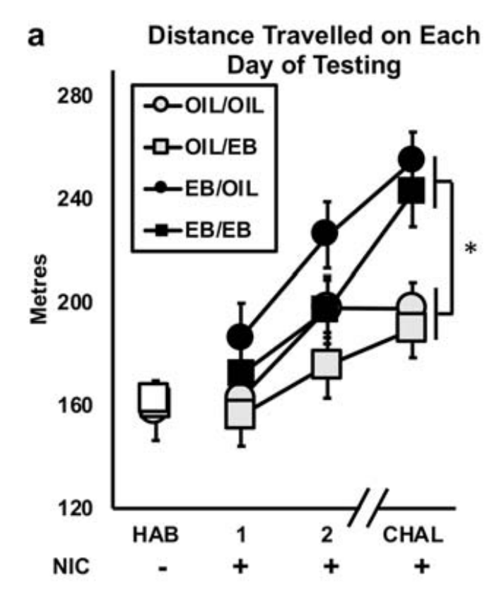

```{r setup, include=FALSE}
require("knitr")
options(htmltools.dir.version = FALSE)
```

# Example Data 

There are many available open-source datasets that can be used to explore the unlimited functionality of data analysis in R. 

I will use data from my [MA thesis](https://dr.library.brocku.ca/handle/10464/14553?show=full) to explore basic graphing and data analysis in R. 

These data are also [Published](https://pubmed.ncbi.nlm.nih.gov/33130925/) in a peer-reviewed journal.

# Methods

- On each of the 4 days of testing, rats completed a 1hr long open field test (run around empty box - 64cm * 64cm).

```{r, echo=FALSE}
knitr::include_graphics("Nic_Paradigm.png")
```

  + Hab: Habituation session (no drug)
  + IND_1: Induction 1 - day after Hab (0.4 mg / kg nicotine)
  + IND_2: Induction 2 - day after IND_1 (0.4 mg / kg nicotine)
  + CHAL: Challenge day. - 9 days after IND_2 (0.4 mg / kg nicotine)

Distance traveled (cm) by each rat during the open field test was captured by an overhead camera and auto-scored by a program called SMART. 

#### *The basis of this paradigm is that rats will increase their locomotor output during repeated administrations of nicotine (i.e. will exhibit locomotor sensitization to repeated nicotine injections).*

- N = 47 adult female [Ovariectomized (OVX)](https://en.wikipedia.org/wiki/Oophorectomy) rats. 
    + *Because all the rats are OVX, they are considered to be estrogen-depleted*

- **Main experimental manipulation**: Administered 5ug estradiol benzoate (synthetic exogenous estrogen; EB) 30 minutes before nicotine injection:
  + On both induction days (n = 12)
  + On the challenge day (n = 12)
  + At both timepoints (n = 12)
  + At neither timepoint (Control, n = 11)

```{r, message=FALSE, result='hide'}
library(tidyverse) # Load the tidyverse
data <- read_csv("EB_Rats_Nicotine_Sensitization.csv") # Call data
```

```{r}
head(data) # Show me the top 6 rows of the data
```

Data organized in the format **one subject one row** (golden rule of data organization).

# Published Result 

Graph made using excel, before I knew how to use R.. :') 

```{r, echo=FALSE, fig.align='center', out.width="60%"}

```

- Many interesting effects in this data!
- Can approach analysis using the GLM in a variety of ways. 
- Feel free to explore SPSS and / or R using this dataset. 


