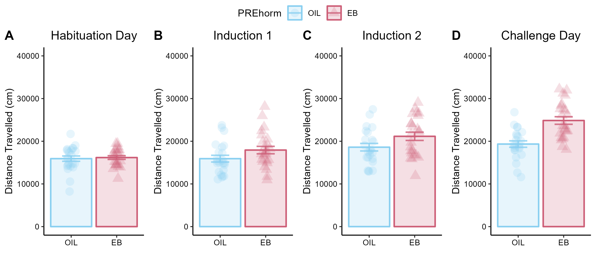

# Utility of functions in R

- Any process that you find you want to carry out repeatedly can be made into a function
- In fact, you *should* make repetitive processes into functions

# DRY vs WET Code

- Both acronyms 

- **DRY - "Don't Repeat Yourself"** 

> DRY (“Don't Repeat Yourself”) principle follows the idea of every logic duplication being eliminated by abstraction. This means that during the development process we should avoid writing repetitive duplicated code as much as possible. This principle can easily be implemented in any programming language

- Instead of reating chunks of code over and over, turn that chunk of code into a *function* to keep the code dry. 

**WET - "Write Evrything Twice", "We Enjoy Typing", "Waste Everyone's Time"** 

- WET code does have some specific utility - especially when producing carefully curated final panels for publication that include chart-specific annotations and significance indicators.

# Simple example of a functions in R

```{r, warning=FALSE, message=FALSE}
my_awesome_function <- function(Input){
  a <- Input
  b <- a / 10
  print(b)
}
```

- Assign a name to the new function
- Assign some number of "inputs" (you may name them anything)
- List a set of processes inside curly brackets
- Include a print() command at the end, if you want your new function what to return something (e.g. a chart or a statistic table)

### Example: 

```{r}
my_value <- 100 
my_awesome_function(my_value) # Pass "my_value" to my_awesome_function
```

Here, the function returned the value of 10 because it divided the input (100) by 10. 

### Custom functions can be scaled to execute extremely comples processes (e.g. graphs & stats), and functions can be compounded (functions inside of functions).

# Complex example of a functions in R

*Problem: the code for a custom ggplot becomes long and cumbersome. When generating a bunch of identical ggplots on different variables, the code becomes convoluted and difficult to navigate.*

### Solution: Generate a custom function to create the specified graph, then pass each of the variables to the function: 

```{r, message=FALSE,warning=FALSE}
library(reshape2) # Load packages
library(tidyverse)
library(ggpubr)

data <- read_csv("EB_Rats_Nicotine_Sensitization.csv") # get data

data$PREhorm = factor(data$PREhorm, # Factorize between subjects variable.
                      levels=c(0,1),
                      labels=c("OIL","EB"))
```

# Wrangle data 
```{r}
a <- data %>% # take "data" AND THEN
  select(c("ID","PREhorm")) # select columns of interest

Hab <- a # assign "a" to a new df named "Hab"
Hab$distance <- data$Hab # attach a column named "distance", containing Hab values from data df. 
IND_1 <- a # Repeat for the other 3 days of testing 
IND_1$distance <- data$IND_1 
IND_2 <- a
IND_2$distance <- data$IND_2 
CHAL <- a
CHAL$distance <- data$CHAL 
rm(a) # Remove the dummy variable a to maintain a clean working environment. 
```

# Define bar graph function
```{r}
bar_graph_function <- function(Input,Input_2,title){
  
n <- Input %>% # take the first input AND THEN
  group_by(PREhorm) %>% # group by btw-sub variable
  summarise(n=n()) # count # of individuals (n)

means <- Input %>% # take the first input AND THEN
  group_by(PREhorm) %>% # group by btw-sub variable
  summarise(mean=mean(distance)) # calculate mean distance

sd <- Input %>% # take the first input AND THEN
  group_by(PREhorm) %>% # group by btw-sub variable
  summarise(mean=sd(distance))  # calculate standard deviation

se <- sd[-1] # remove ID column for next step :)
se <- se / sqrt(n$n-1) # Calculate standard error

m_means <- melt(means) # switch to long form
m_se <- melt(se) # switch to long form
m_means$se <- m_se$value # Attach se column to "m_means" df

a <- ggplot(m_means, aes(x=PREhorm,y=value,colour=PREhorm, shape=PREhorm, fill=PREhorm))+
    geom_bar(stat="identity", alpha=0.2,size=0.8)+
    geom_errorbar(aes(x=PREhorm,ymin=value-se,ymax=value+se), width=0.4, size=0.8, alpha=0.8)+
    scale_colour_manual(values=c("#89CFF0","#CD5E77"))+
    scale_fill_manual(values=c("#89CFF0","#CD5E77"))+
    theme_classic()+
    theme(legend.position = "none")+ # remove useless legend
    theme(plot.title = element_text(hjust=0.5))+
    theme(axis.text.x = element_text(colour="black"))+
    theme(axis.text.y = element_text(colour = "black"))+
    theme(axis.title.x = element_text(colour= "black"))+
    theme(axis.title.y = element_text(colour = "black"))+
    labs(x="",
         y="Distance Travelled (cm)",
         title=title)+
    ylim(0,40000)

b <- a +
  geom_jitter(data=data, aes(x=PREhorm,y=Input_2), size=4,alpha=0.2, width=0.1)

return(b)
}
```

# Use bar_graph_function
```{r,message=FALSE,warning=FALSE}
A <- bar_graph_function(Hab,data$Hab,"Habituation Day")
B <- bar_graph_function(IND_1, data$IND_1, "Induction 1")
C <- bar_graph_function(IND_2, data$IND_2, "Induction 2")
D <- bar_graph_function(CHAL, data$CHAL, "Challenge Day")

# Check out the 4 graphs
A 
B
C
D
```

# Create Panel

Arrange the 4 ggplots made with the function into a panel to see the data side-by-side. 

```{r}
EB_panel <- ggarrange(A,B,C,D,
          ncol=4,nrow=1,
          labels = c("A","B","C","D"),
          common.legend = TRUE)

EB_panel
```

To generate a more high-quality version of the panel, save it as a .png image with dpi=300, then call back the .png. 
- This approach also allows for control of the dimensions of the image (in inches):
```{r}
ggsave("EB_panel.png",EB_panel,height=4,width=9,dpi=300)


```


