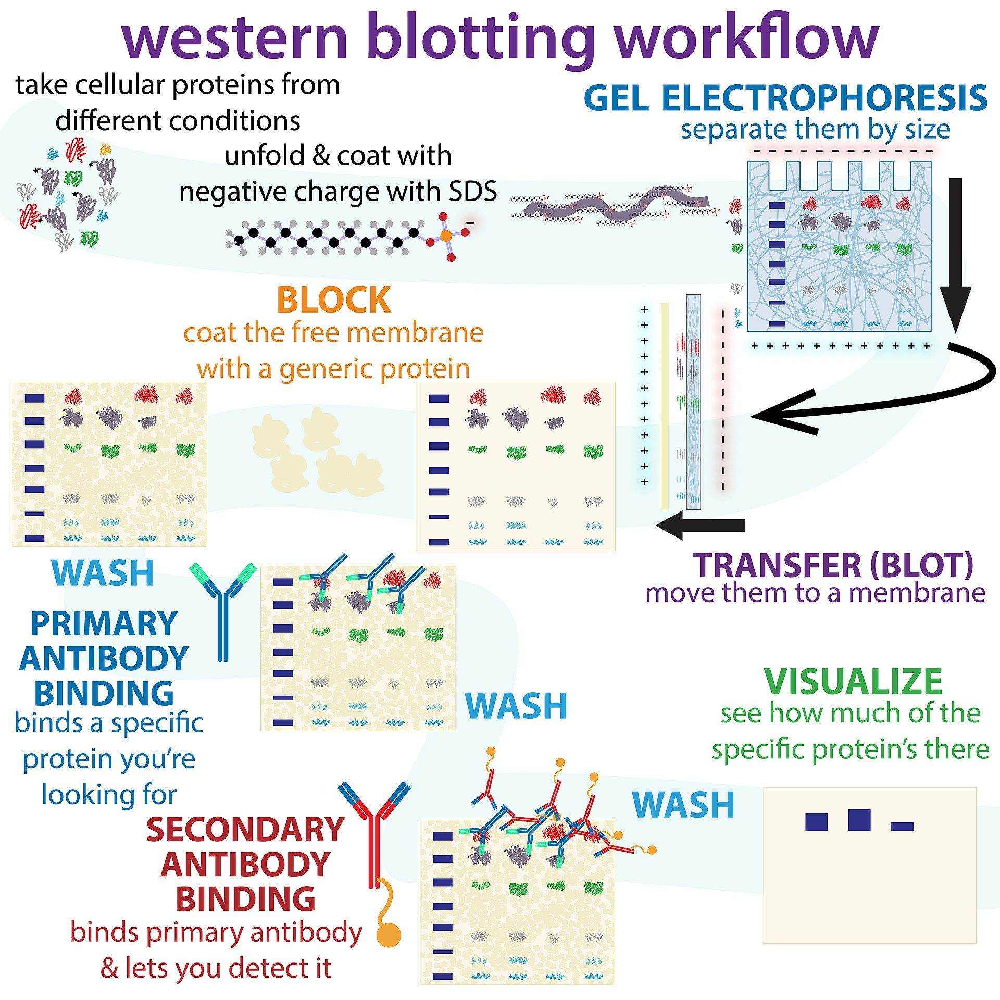
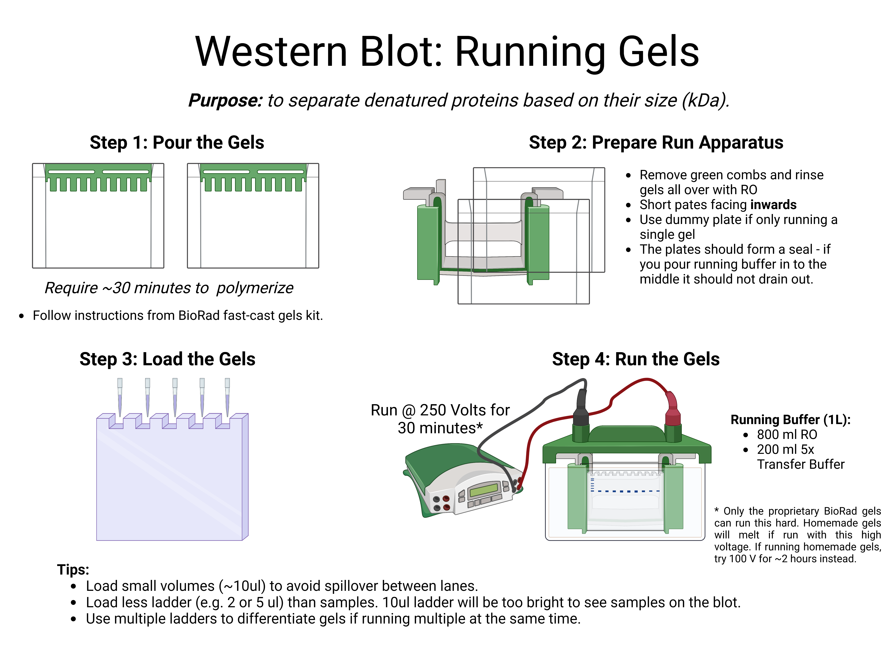
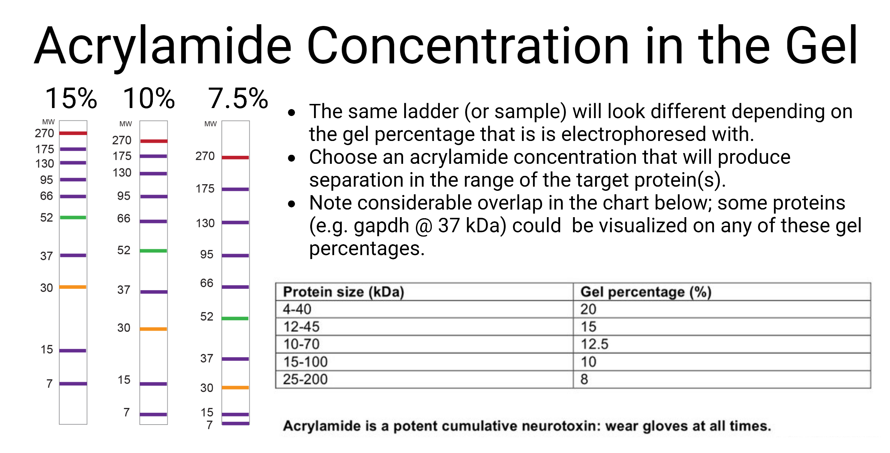
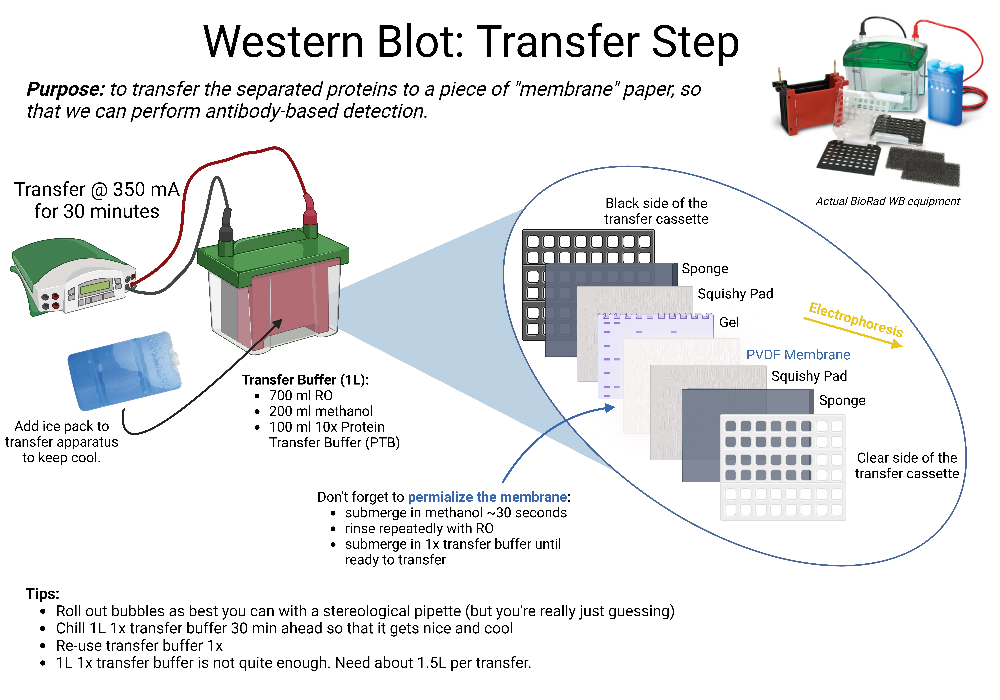

```{r setup, include=FALSE}
knitr::opts_chunk$set(echo = FALSE, warning = FALSE, message = FALSE, fig.align = "center",out.width = "70%")
```

# Background

- Western blotting allows for rapid semi-quantitative analysis of relative levels of a protein (s) of interest in a set of samples. 
- Adaptation of the theory used to "blot" RNA (Northern Blotting) and DNA (southern blotting) for protein. 
- Samples are pulled through a gel via electrophoresis to sort them by size. 
- Separated proteins are transferred onto a peice of "membrane" paper, where antibody-based detection can be used to probe protein concentrations. 

# Tissue Collection

Western blotting can be used for protein detection in a variety of sample types (e.g. blood), but typically brain tissue is used in neuroscience applications. Fresh brain tissue should be snap-frozen either via isopentane on dry ice or liquid nitrogen. Perfused brain tissue cannot be used for western blotting because perfusion 'fixes' proteins in their [quatrinary formations](https://en.wikipedia.org/wiki/Protein_quaternary_structure), meaning that they cannot be denatured.

- Prepare 1in*1in pieces of tin foil with animal IDs written on both sides in sharpie for tissue collection. 
- Chill ~50 ml of isopentane on dry ice for >10 mins before beginning. 
- Fill the isopentane beaker right up to the top to avoid fresh tissue touching cold glass. If brains touch the frozen walls of the beaker they will stick.
- Store snap-frozen brains wrapped in tin foils at -80 until the time of sample processing. 
- Isopentane can be stored in the fridge and re-used until it disappears (evaporates at room temperature).

# Dissection 

*The process that you will follow to dissect region(s) of interest will depend on your specific experimental parameters*

- Thaw brains one at a time in a 50ml beaker of aCSF / PBS on ice. 
- At first, brains will float. They will be thawed enough to dissect soon after they sink. 
- Lift brains out carefully with a spoon, and dissect on a glass petrie dish covered with moistened filter paper. 
- Re-freeze samples in individually labelled tubes on dry ice. 
- Store samples in a Styrofoam container filled with dry ice while working and at -80 until the time of tissue processing. 

# A "graphical abstract" of the Western Blotting Process:

*(borrowed from the [Wikipedia page on Western Blotting](https://en.wikipedia.org/wiki/Western_blot), which has tons of useful info):*

```{r}

```

# Tissue Processing 

*Purpose: to break cells open so that all the proteins inside them are "dumped" into a "protein soup"*

-	Must add **inhibitors** to prevent degredation of target proteins by endogenous enzymens in the sample. 
  + Always add [protease inhibitor](https://www.sigmaaldrich.com/CA/en/product/roche/04693159001) to prevent general protein degredation. 
  + Add [phosphotase inhibitor](https://www.sigmaaldrich.com/CA/en/product/roche/phossro?gclid=CjwKCAjwge2iBhBBEiwAfXDBR9vTNHUQ_HwzxqfByrqoqjlv4HrcnrupWq7N-Iia4J5mbvGefaBMOxoC1fsQAvD_BwE&gclsrc=aw.ds) if targeting phosphorylated proteins. 

**Basic tissue processing for whole-cell lysates:**

- To Lyse cells, use some combination of salt and soap. Soap will deteriorate the fatty cell membranes (just like it erodes grease in your sink!). 
- [Pre-purchased RIPA](https://www.sigmaaldrich.com/CA/en/product/mm/20188) buffer is a great lysis buffer option. Only make your own solutions if you need to for some experiment-specific reason. 
- Dilute RIPA to working concentration before use (stock is 10x - combine 1ml STOCK + 9ml RO).
  + Add inhibitor tablet(s)! **Very important, don't forget!**
- Add *"an appropriate volume"* of 1x RIPA buffer (with dissolved inhibitors) to your samples. 
  + the goal is to create a protein soup that falls in the "goldilocks" (detectable) range - not too concentrated but also not too dilute. 
  + smaller pieces of tissue should be processed with less lysis buffer. 
  + JB + AML 2022/2023 ~150ul works perfect for bilateral ACC samples. 
- Homogenize samples with the automatic tool or by hand with a pipette. 
  + Goal is to create a relatively homogeneous looking greyish / yellowish mixture. 
- Centrifuge samples for 20 minutes at MAX (17500 x G). 
- Collect back 5/6ths of the initial volume of RIPA buffer added, leaving behind the pellet that formed after centrifugation. 
  + This optional step removes chromatin and other long stringy non-homogenized junk from the samples.
  + Removing chromatin improves the end result of the Westerns. 
  
*Use a more refined tissue processing protocol to separate out sub-cellular compartments*
  
# Bradford Assay

*Purpose: To measure protein concentrations in each sample* 

```{r}
a <- c("Blank","A","B","C","D","E")
b <- c(0,1,0.5,0.25,0.125,0.0625)
c <- c(500,500,500,500,500,500)
d <- c("Nothing","500 STOCK","500 A", "500 B", "500 C", "500D")

bradford <- as.data.frame(cbind(a,b,c,d))
colnames(bradford) <- c("Label","Protein Concentration","RO to Add", "BSA to Add")
```

### Materials

- [96-well plate](https://www.google.com/search?q=96+well+plate&rlz=1C1CHBF_enCA937CA937&sxsrf=APwXEdca6xamRTS2uF8oCBQ4KjZGfmBe6A:1683718459246&source=lnms&tbm=isch&sa=X&sqi=2&ved=2ahUKEwiNxqiF1Or-AhWHpokEHdGrA7kQ_AUoAXoECAIQAw&biw=1058&bih=1059&dpr=1.82) (can clean with ethanol and reuse - doesn't need to be brand new)
- [Bradford dye](https://www.thermofisher.com/order/catalog/product/23246?gclid=CjwKCAjw3ueiBhBmEiwA4BhspFKHG_-C8hGQrqQTux8BWOggdMTY9Gtqe1Q0K5qwQiVCSJMio_Y2QBoCx04QAvD_BwE&ef_id=CjwKCAjw3ueiBhBmEiwA4BhspFKHG_-C8hGQrqQTux8BWOggdMTY9Gtqe1Q0K5qwQiVCSJMio_Y2QBoCx04QAvD_BwE:G:s&s_kwcid=AL!3652!3!437211904039!!!g!!!10122613083!101638248476&cid=bid_pca_sbu_r01_co_cp1359_pjt0000_bid00000_0se_gaw_dy_pur_con)
- [Repeater pipette](https://www.eppendorf.com/product-media/doc/en_us/140712/Eppendorf_Liquid-Handling_Brochure_Multipette-E3-E3x_Generation-E.pdf) and [required disposables](https://www.pipettes.com/eppendorf-combitips-advanced-5-0-ml-sterile-individual-wrapped-100-pack)
- [BSA](https://www.uoftmedstore.com/item_detail.sz?id=25597) at a STOCK concentration of 1 mg / ml to make into a standard

### Procedure

#### Prepare Standard Curve: 

- Label a set of tubes A:E
- Add 500 ul RO to each
- Thaw an aliquot of 1 mg/ml BSA (-20 freezer, bottom shelf, left side)
- Add 500 ul STOCK BSA to tube A
- Serial dilute down the line by half: 

```{r, out.width = "50%"}
knitr::kable(bradford, "simple", align="lccc")
```

#### Prepare Bradford Samples:

- Label a set of tubes with sample IDs (These will be garbage after the Bradford is done)
- add 45ul RO to each tube 
- add 5ul protien lysate -> Vortex.
  + The Bradford samples can sit at on the bench at room temperature.
  + Leave the remaining protein stocks on ice while running the Bradford assay. 

#### Prepare the Assay Plate:

- Set up Assay Plate (Pipette all in triplicates in a 96 well plate. Label the lid with subject numbers to make sure you know who’s who..) 
  + Blank (10 µl RO)
  + Standard (10 µl A – E) 
  + Samples - 10 µl each 
  + Run samples in triplicate because the Bradford is a crude assay (allows you to drop one point if it's a clear outlier from the other two - e.g. D7 in the image below).
- Add 200ul [Bradford dye](https://www.thermofisher.com/order/catalog/product/23246?gclid=CjwKCAjw3ueiBhBmEiwA4BhspFKHG_-C8hGQrqQTux8BWOggdMTY9Gtqe1Q0K5qwQiVCSJMio_Y2QBoCx04QAvD_BwE&ef_id=CjwKCAjw3ueiBhBmEiwA4BhspFKHG_-C8hGQrqQTux8BWOggdMTY9Gtqe1Q0K5qwQiVCSJMio_Y2QBoCx04QAvD_BwE:G:s&s_kwcid=AL!3652!3!437211904039!!!g!!!10122613083!101638248476&cid=bid_pca_sbu_r01_co_cp1359_pjt0000_bid00000_0se_gaw_dy_pur_con) to each well using the [repeater pipette](https://www.eppendorf.com/product-media/doc/en_us/140712/Eppendorf_Liquid-Handling_Brochure_Multipette-E3-E3x_Generation-E.pdf). 
- let stand 5-10 minutes (depends who you ask)
- Read at 595 nm in the bio shared space (third floor)
  + The computer is **slow**, best to set up ahead of time. 
  + Use Gen5 - same as the cytation. 

```{r}
knitr::include_graphics("Bradford_Assay.png")
```

# Match Protein Concentrations

*Purpose: To match protein concentrations in the simplest and most consistent way possible.*

Dilute across two steps: 

1. Dilute with lysis buffer to 1.33 ug / ul 
2. Add 1:3 [Pre-fab loading buffer](https://www.bio-rad.com/en-ca/sku/1610747-4x-laemmli-sample-buffer?ID=1610747)** to each sample

** Add [BME](https://www.sigmaaldrich.com/CA/en/product/aldrich/m6250) as per the label instructions to a tube of loading dye right before use. Don't add BME to the stock bottle - it isn't shelf stable

- Keep it simple: Just enter the protein concentrations observed in the protein assay, and follow the sheet. 
- Go through all the samples adding RIPA buffer. 
- Go through again to add loading dye. 
  + SDS (soap) in the loading dye gives the proteins in the samples a uniform negative charge. 
  + Negative charge will facilitate migration through the gel in the subsequent steps (the positively charged electrode in the WB run procedure pulls the contents through the gel). 
- Works best with two people: One reading the volume to add and the other just pipetting. 
- Heat samples at 65 degrees for 10 minutes in the heating block. 
  + Heading (in combination with the loading buffer will [denature the proteins](https://en.wikipedia.org/wiki/Denaturation_(biochemistry)))
- store samples at -20 until Western Time. 

# Western Blots: Day 1 (of 2)

### Overview of steps to run the western gel: 

```{r}

```

### Step #1: Casting Gels

**Materials**

- [BioRad FastCast Gel kit](https://www.bio-rad.com/en-ca/sku/1610173-tgx-fastcast-acrylamide-kit-10?ID=1610173)
  + The gel percentage can be adjusted based on the size of your protein of interest: 
- Temed (4 degrees - common chemicals tray)
- 10% APS (4 degrees with the Temed OR aliquated @ -20 - bottom shelf left side)
  + To make stock: 1 gram APS powder + 10 ml RO -> dissolve and aliquot in 1ml tubes. 
- 15 mL falcon tubes (2 - label one "resolver" and the other "stacker")

```{r, out.width="75%"}

```

**Procedure**

- Mix A & B for the resolver and stacker in their respective tubes
  + Follow the sheet that came with the kit for proportions per gel
  + OR see [this informative 3-minute youtube video on casting gels](https://www.youtube.com/watch?v=fd1P39S9udI)
  + If you choose to watch the video, ignore the thing about marking the glass plates with a sharpie. Eyeball instead, please.
- Add temed + APS to resolver tube -> use a [10 ml sterological pipette](https://www.google.com/search?q=10+ml+serological+pipette&&tbm=isch&ved=2ahUKEwiQ0-Cc0er-AhWJJGIAHUcsBpEQ2-cCegQIABAA&oq=10+ml+serological+pipette&gs_lcp=CgNpbWcQAzIFCAAQgAQyBwgAEBgQgAQyBwgAEBgQgAQ6BAgjECc6BwgAEIoFEEM6BggAEAcQHlDmC1jpEGDxEWgAcAB4AIABTogBiwSSAQE3mAEAoAEBqgELZ3dzLXdpei1pbWfAAQE&sclient=img&ei=R35bZNCTBYnJiLMPx9iYiAk&bih=1059&biw=1058&rlz=1C1CHBF_enCA937CA937) to pour ~4/5ths of the way up the plate.
- Add temed + APS to the stacker tube -> use a 1ml pipette to fill the glass plates with the stacker solution until it spills over the top. 
- Insert the green comb to create the wells.
  + Any chips in the glass plates will increase likelihood of the gel partially leaking out / falling / generally not working. 
  + We almost always need more [short glass plates](https://www.bio-rad.com/en-ca/sku/1653308-mini-protean-short-plates?ID=1653308) because they are thin and prone to chipping. 
  + Try not to cause bubbles... Bubbles are the worst. 
  + If you see a bubble early, it will only grow throughout the polymerization process.. 
  + Can make extra gels. Unused gels can be wrapped in wet paper towels and stored in a ziploc bag @ 4 degrees. 

### Step #2: Prepare Run Apparatus 

- Add two plates into the **apparatus with the prongs**
  + The apparatus without the prongs is for running 3+ gels in the same tank (we don't like to do that - they don't run as nice.)
- See this [youtube video](https://www.google.com/search?q=biorad+western+gel+run&rlz=1C1CHBF_enCA937CA937&sxsrf=APwXEdesi4TDovqYOrCJeo4UISaOS8lM-g%3A1683719221345&ei=NYRbZKnUFNKfptQPvo2E-Ak&ved=0ahUKEwjpwtvw1ur-AhXSj4kEHb4GAZ8Q4dUDCA8&uact=5&oq=biorad+western+gel+run&gs_lcp=Cgxnd3Mtd2l6LXNlcnAQAzIICAAQFhAeEAoyBggAEBYQHjIGCAAQFhAeMggIABAWEB4QCjIICAAQFhAeEAoyCAgAEBYQHhAKMggIABAWEB4QCjIICAAQFhAeEAoyCAgAEBYQHhAKMggIABAWEB4QCjoECCMQJzoHCCMQigUQJzoHCAAQigUQQzoICAAQigUQkQI6DQguEIoFEMcBENEDEEM6DQgAEIoFELEDEIMBEEM6CggAEIoFEMkDEEM6CAgAEIoFEJIDOgoIABCABBAUEIcCOgsILhCDARCxAxCABDoICAAQgAQQsQM6EQguEIAEELEDEIMBEMcBENEDOgsIABCABBCxAxCDAToFCAAQgAQ6CgguEIAEENQCEAo6BQguEIAEOgsILhCABBDHARCvAToHCCMQsQIQJzoTCC4QigUQsQMQgwEQxwEQ0QMQQzoQCC4QgAQQxwEQ0QMQ1AIQCjoTCC4QgAQQsQMQgwEQxwEQ0QMQCjoQCC4QgAQQsQMQgwEQ1AIQCjoKCAAQgAQQyQMQCjoNCAAQgAQQsQMQgwEQCjoQCC4QigUQsQMQgwEQ1AIQQzoHCCMQ6gIQJzoNCAAQjwEQ6gIQtAIYAToNCC4QjwEQ6gIQtAIYAToLCC4QgAQQsQMQgwE6FAguEIAEELEDEIMBEMcBENEDENQCOg0ILhCKBRDHARCvARBDOgoIABCKBRCxAxBDOhMIABCABBAUEIcCELEDEIMBEMkDOhUILhCKBRCxAxCDARDHARDRAxAKEEM6CQgAEIoFEAoQQzoHCAAQgAQQCjoNCC4QgAQQxwEQrwEQCjoICAAQigUQhgNKBAhBGABQAFihKWD-KWgJcAF4AIABvQGIAfoVkgEFMTUuMTOYAQCgAQGwARTAAQHaAQYIARABGAo&sclient=gws-wiz-serp#fpstate=ive&vld=cid:71869aa1,vid:0nnp4Ugyjas,st:44) for instructions on preparing the gel apparatus and loading samples. 

### Step #3: Loading Samples

- If you matched all your samples to 1 ug / ul (see "Matching Protein Concentrations", above), load equal volumes into each lane of the gel. 
  + Best practice! - yeilds the most consistent run. 
- Try not to poke the gel at all with the pipette tip. 

### Step #4: Run the Gel

- Make sure that the BLACK mark on the side of the gel holding apparatus lines up with the BLACK mark on the side of the tank (and that on the other side, RED goes with RED..).
- Ensure that the cables are attached such that BLACK-BLACK and RED-RED.
- Failure to match the colours will result in terrible things. 
- Watch the purple line move through the gel. 

```{r}

```

*also see [this informative video](https://www.google.com/search?q=western+blot+transfer&rlz=1C1CHBF_enCA937CA937&oq=western+blot+transfer&aqs=chrome.0.0i512l10.3790j0j7&sourceid=chrome&ie=UTF-8#fpstate=ive&vld=cid:830e2b98,vid:NWiVUXcQxjY) for more info*

##### At the end of the transfer: 

- Open the sandwiches 
  + you should see the coloured bands of the ladder transferred over to the membrane. 
  + throw the gel out now
  + **If running multiple membranes, make them clearly identifiable in some way.** (e.g., cut notches in opposite corners)
  
- Mix up some "wash buffer"
  + 999ml 1x TBS 
  + 1ml tween80 (pipette slowly - it's very thick.) 

# Block the Membrane 

*Purpose: to reduce non-specific signal by blocking binding sites on the PVDF membrane to prevent primary antibody binding.*

- **10% [Milk](https://www.uoftmedstore.com/item_detail.sz?id=32228)** dissolved in TBS-T is the preferred blocking agent. 
  + generally, people use 5% milk in their protocols.
  + JLB once accidentally made 10% milk, and it made the membrane SO WHITE and beautiful. 
  + Therefore, 10% milk is the preferred blocking agent.
  + More information about the utility of milk as a blocking agent can be found at [this link](https://www.mdc-berlin.de/news/news/labhacks-blocking-sticky-proteins-milk-powder)
  
- **If probing for phospho-proteins, DO NOT USE MILK** 
  + Milk contains phospho-proteins. Primary antibody will bind to milk. Blot will look awful. 
  + USE 3% [BSA](https://www.uoftmedstore.com/item_detail.sz?id=25597) diluted in TBS-T as a blocking agent instead. 

- *Note that BSA is >10x more expensive than milk.*

**Procedure:**

- dissolve blocking agent in TBS-T
- Pour 10ml blocking agent over membrane in one of the coloured containers. 
  + 2 membranes per container is ok - but the sides of the membraes with the proteins need to be facing OUTWARDS (i.e. up and down; not facing the other membrane)
- Incubate on the rocker on the bench for 1 hour
- discard the block buffer 

# Primary Antiboy Incubation

*Purpose: To facilitate specific binding of the primary antibody to the target antigen on the membrane.*

- Overnight (rocking) in the fridge is the preferred method for primary antibody binding. 
- Can cut membranes to execute multiple stains at once, but the number of cuts should be minimized (max 3 pieces of membrane).
  + Maintain identifiable snips on the different pieces of the membrane. 
  + e.g. each piece that came from gel 1 has a snip in the upper left-hand corner, every piece from gel 2 has a snip in the upper right-hand corner)
- Mix primary antibody at *optimized concentration* in the blocking agent (e.g. 10% milk or 3% BSA - use the same as what you blocked with.)
  + 1:1000 is a good place to start but sometimes needs to be adjusted.
  + See product sheets for the specific antibody. 

# Western Blots day 2: Secondary Antibody & Imaging 

*Purpose: To bind a fluorescent secondary antibody to the primary antibodies (which are bound to their target antigens)*
- Secondary antibody binding will facilitate detection in a fluorescent imager (e.g. the [iBright 1500](https://www.thermofisher.com/ca/en/home/life-science/protein-biology/protein-assays-analysis/western-blotting/detect-proteins-western-blot/western-blot-imaging-analysis/ibright-systems.html?gclid=CjwKCAjwge2iBhBBEiwAfXDBR8b6E8G2L6lvKVzS1gaMzEbHe_iT6rllbbTbkgyMoypWb-p-Bc5axxoCCAUQAvD_BwE&ef_id=CjwKCAjwge2iBhBBEiwAfXDBR8b6E8G2L6lvKVzS1gaMzEbHe_iT6rllbbTbkgyMoypWb-p-Bc5axxoCCAUQAvD_BwE:G:s&s_kwcid=AL!3652!3!517481603440!p!!g!!blot%20imager!834777250!54909844685&cid=bid_pca_ibt_r01_co_cp1359_pjt0000_bid00000_0se_gaw_nt_lgn_ins)). 

- Dump primary antibodies into labelled 15ml falcon tubes 
  + NAME, DATE, ANTIBODY, CONCENTRATION
  + Store @ -20 for up to 1 month
  + Can re-use 2-3x 
- Wash membrane quickly 3x with TBS-T
- Wash membrane 3x for longer (5 min on the rocker each)
  + It is important to fully remove residue of primary antibody before proceeding to the secondary antibody step. 
- Add 7ml of secondary antibody at 1:5000 concentration dissolved in blocking agent. 
  + Secondary antibody needs to target the species that the primary antibody was raised in. 
  + The link above targets rabbit-raised primary antibodies (most common) and appears in the visible range on Green800 on Iva's fluorescent imager.
  + Incubate 1 hour on the rocker on the bench
  + Dump down the sink at the end of the hour 
- Wash membranes 5x + with TBS-T. Residual secondary antibody can interfere with image detection. 

##### IMAGE - Save pictures on USB

**You must have both a target protein and a normalizer protein (loading control) for each membrane**

- In the example below, the intensity of the GR band would be divided by the intesity of the corresponding gapdh band. 

```{r}
knitr::include_graphics("Rep_WB.png")
```


