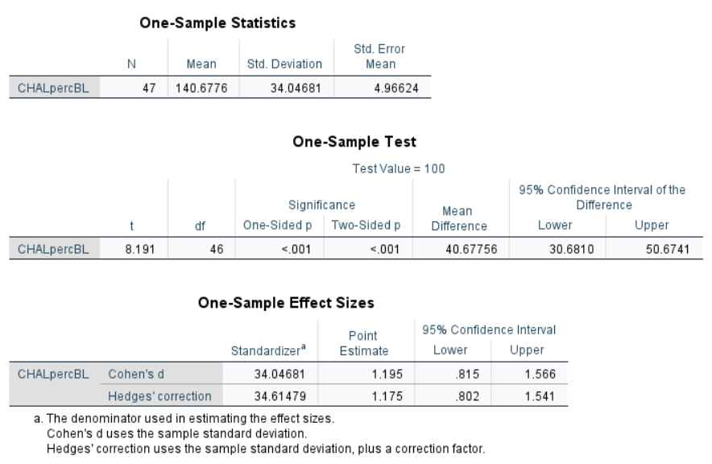
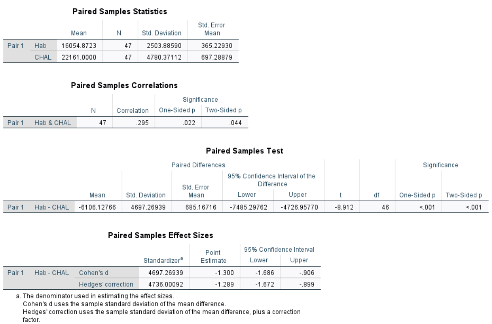
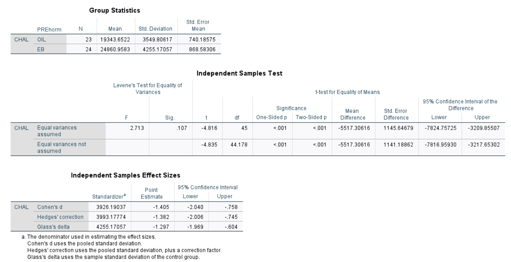

```{r setup, include=FALSE}
knitr::opts_chunk$set(echo = TRUE,
                      message = FALSE,
                      warning = FALSE)
library(tidyverse)
```

# The General Linear Model
The GLM is a *family* of analytic approaches that involves fitting lines to data points.

# The underlying formula for the GLM: 

$$ \dfrac{signal}{noise} $$

$$ \dfrac{systematic\; variance}{error\; variance} $$

- The "statistic" that you see reported represents this ratio. 
    + e.g. *t* (15) = 4.51, *p* = 0.02
    + 4.51x more systematic variance than error variance
    + 2% chance that these scores belong to a common distribution

## GLM can be broadly divided into 3 families of analyses: 

1. t-tests
- involve comparisons between two groups
- **require** a *categorical IV* and a *continuous DV*

2. ANOVA (& cousins: MANOVA,ANCOVA,MANCOVA)

3. Regressions 


# Types of t-tests:

1. one-sample t-test
2. paired samples t-test (aka "dependent samples")
3. independent samples t-test

```{r, echo=FALSE}
knitr::include_graphics("t.test_types.png")
```

# One sample t-test
- As the name implies, involves a situation where you are testing one group of individuals against a single "known" value. 
- Common example would be % baseline

$$ One\; Sample\; t = \dfrac {\bar{X} - \mu}{s / \sqrt(n)} $$

WHERE 
- "X bar" =  mean of your sample
- "mew" = the population mean you are testing against
- "s" = standard deviation of the sample you tested
- "n" = the sample size 

# Paired Samples t-test
- Involves comparing multiple measurements from a single sample of people (usually)
    + Sometimes used for "matched" samples (e.g. twins in human studies)

$$ Paired\; Samples\; t = \dfrac {\Delta \bar{X}}{\Delta s / \sqrt(n)}  $$

WHERE
- "Delta X bar" = Change in the mean between the two measurements 
- "Delta s" = Change in standard deviation between the two measurements 
- "n" = sample size

# Independent Samples t-test
- involves comparing two unrelated groups. 

$$  t = \dfrac {\bar{X1} - \bar{X2}} {SD_{pooled}}  $$

# Example - EB_Nicotine_Rats

Demonstration - test out running all 3 types of t-tests in both SPSS and R. 

# One sample t-test in SPSS

{SPSS}
COMPUTE CHALpercBL = (CHAL / Hab)*100.
Execute. 

T-TEST
  /TESTVAL=100
  /MISSING=ANALYSIS
  /VARIABLES=CHALpercBL
  /ES DISPLAY(TRUE)
  /CRITERIA=CI(.95).


```{r,echo=FALSE, out.width="50%"}

```

# One sample t-test in R 
```{r}
data <- read_csv("EB_Rats_Nicotine_Sensitization.csv")

data$CHALpercBL <- (data$CHAL / data$Hab) * 100
t.test(data$CHALpercBL, mu = 100)
```

> Distance travelled on the challenge day was significantly higher than indivdual baseline measurements (one sample *t*(46) = 8.19, *p* <0.001)

# Paired samples t-test in SPSS
{SPSS}
T-TEST PAIRS=Hab WITH CHAL (PAIRED)
  /ES DISPLAY(TRUE) STANDARDIZER(SD)
  /CRITERIA=CI(.9500)
  /MISSING=ANALYSIS.


```{r,echo=FALSE,out.width="75%"}

```

# Paired samples t-test in R
```{r}
Hab <- data$Hab
Chal <- data$CHAL

t.test(Chal, Hab, paired = TRUE, var.equal = TRUE)
```

> Rats increased distance travelled between the habituation session and the challenge day (paired *t*(46) = 8.91, *p* < 0.001)

# Independent Samples t-test in SPSS

{SPSS}
T-TEST GROUPS=PREhorm(0,1)
    /MISSING=ANALYSIS
    /VARIABLES=CHAL
    /CRITERIA=CI(.95).

```{r,echo=FALSE,out.width="75%"}

```

# Independent Samples t-test in R
```{r}
t.test(Chal~PREhorm, data=data, var.equal = TRUE)
```

> On the challenge day, rats treated with EB during the "induction" phase of sensitization travelled longer distances than those treated with OIL (*t*(45) = 4.82, *p* < 0.001)


