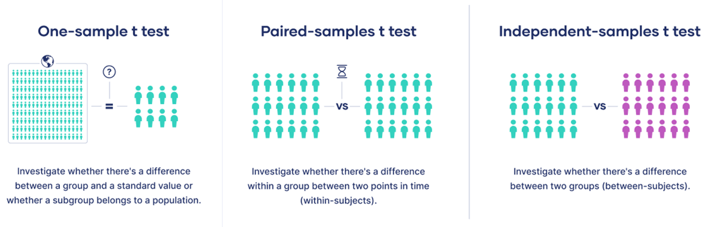

```{r setup, include=FALSE}
knitr::opts_chunk$set(echo = TRUE,
                      message = FALSE,
                      warning = FALSE)
options(scipen=999)
library(tidyverse)
library(ggpubr)
library(reshape2)
```

# The General Linear Model
The GLM is a *family* of analytic approaches that involves fitting lines to data points.

# The underlying formula for the GLM: 

$$ \dfrac{signal}{noise} $$
Or, in other words, 

$$ \dfrac{systematic\ variance}{error\ variance} $$

- The "statistic" that you see reported represents this ratio. 
    + **e.g. *t* (15) = 4.51, *p* = 0.02**
    + 4.51x more systematic variance than error variance
    + 2% chance that these sets of scores belong to a common parent distribution

# GLM can be broadly divided into 3 families of analyses: 

**1. t-tests**
- involve comparisons between two groups
- **require** a *categorical IV* and a *continuous DV*

2. ANOVA (& cousins: MANOVA,ANCOVA,MANCOVA)

3. Regressions 


# Types of t-tests:

There are 3 distinct yet related types of t-tests, each used for unique scenarios:

1. one-sample t-test
2. paired samples t-test (aka "dependent samples")
3. independent samples t-test

```{r, echo=FALSE}

```

# One sample t-test
- As the name implies, involves a situation where you are testing one group of individuals against a single "known" value. 
- Common example in the field of behavioural neuroscience would be  comparing behaviour to individual baseline measurements.

$$ One\ Sample\ t = \dfrac {\bar{X} - \mu}{s / \sqrt(n)} $$

WHERE 
  + "X bar" =  mean of your sample
  + "mew" = the population mean you are testing against
  + "s" = standard deviation of the sample you tested
  + "n" = the sample size 

# Paired Samples t-test
- Involves comparing multiple measurements from a single sample of people (usually)
    + Sometimes used for "matched" samples (e.g. twins in human studies)

$$ Paired\; Samples\; t = \dfrac {\Delta \bar{X}}{\Delta s / \sqrt(n)}  $$

WHERE
  + "Delta X bar" = Change in the mean between the two measurements 
  + "Delta s" = Change in standard deviation between the two measurements   
  + "n" = sample size

# Independent Samples t-test
- involves comparing two unrelated groups. 

$$  t = \dfrac {\bar{X1} - \bar{X2}} {SD_{pooled}}  $$
WHERE 
  + "X bar_1" = The mean of the first group (control)
  + "X bar_2" = The mean of the second group (test)
  + "SD_pooled" = The pooled standard deviation of the two groups

# Examples using EB_Nicotine_Rats

### [Link to raw data used in this example.](https://github.com/black-cat-enthusiast/Blogdown_Test/blob/master/content/post/2023-07-12-Example-Data/EB_Rats_Nicotine_Sensitization.csv)

#### *Below are codes to execute each type of t-test in R.*

# One sample t-test in R 
```{r}
data <- read_csv("EB_Rats_Nicotine_Sensitization.csv")

data$CHALpercBL <- (data$CHAL / data$Hab) * 100
t.test(data$CHALpercBL, mu = 100)
```

## Written result:

> Distance travelled on the challenge day was significantly higher than indivdual baseline measurements (one sample *t*(46) = 8.19, *p* <0.001).

## Graphical representation of this analysis:

The deviations (aka the "error variance") for each model are compared. If the statistic is significant (*p* < 0.05), it would indicate that the mean is a significantly better predictor of the data than the null model (in this case, the mean).

```{r,echo=FALSE}
M_null <- data %>%
  select(c("ID","Hab","CHAL")) %>%
  mutate(percBL = (CHAL / Hab)*100) %>%
  mutate(Average = mean(percBL)) %>%
  ggplot(aes(x=ID,y=percBL)) + 
  geom_point(size=4,alpha=0.8) +
  theme_classic()+
  theme(plot.title = element_text(hjust=0.5))+
  theme(plot.subtitle = element_text(hjust=0.5))+
  geom_hline(yintercept=100,linetype="dashed")+
  geom_segment(aes(x=ID, y=percBL, xend=ID,yend=100), size=1, alpha=.4)+
  labs(y="Percent Baseline",
       title = "Null Hypothesis",
       subtitle = "Deviations from 100 are calculated \n for each individual")+
  ylim(0,300)

M_test <- data %>%
  select(c("ID","Hab","CHAL")) %>%
  mutate(percBL = (CHAL / Hab)*100) %>%
  mutate(Average = mean(percBL)) %>%
  ggplot(aes(x=ID,y=percBL)) + 
  geom_point(size=4,alpha=0.8) +
  theme_classic()+
  theme(plot.title = element_text(hjust=0.5))+
  theme(plot.subtitle = element_text(hjust=0.5))+
  geom_hline(yintercept=100,linetype="dashed")+
  geom_hline(yintercept = 140.6776, linetype = "dashed", colour="#800020")+
  geom_segment(aes(x=ID, y=percBL, xend=ID,yend=140.6676), size=1, alpha=.4,colour="#800020")+
  labs(y="Percent Baseline",
       title = "Alternative Hypothesis",
       subtitle = "Deviations from the mean score \n are calculated for each individual")+
  ylim(0,300)

ggarrange(M_null,M_test)
```


# Paired samples t-test in R

```{r}
Hab <- data$Hab
Chal <- data$CHAL

t.test(Chal, Hab, paired = TRUE, var.equal = TRUE)
```

```{r,echo=FALSE}

a <- data %>%
  select(c("ID","PREhorm","Hab","CHAL")) %>%
  melt(id.vars = c("ID","PREhorm")) %>%
  ggplot(aes(x=variable,y=value,group=ID)) + 
  geom_line(size=1,alpha=0.5)+
  theme_classic()+
  theme(plot.title = element_text(hjust=0.5))+
  labs(x=" ",
       y="distance travelled (cm)",
       title = "Change in distance travelled")

b <- data %>%
  mutate(diff=CHAL-Hab) %>%
  select(c("ID","PREhorm","diff")) %>%
  ggplot(aes(x=ID,y=diff))+
  geom_point(size=5,alpha=0.8)+
  geom_hline(yintercept = 0, linetype="dashed")+
  geom_segment(aes(x=ID, y=diff, xend=ID,yend=0), size=1, alpha=.4)+
  theme_classic() +
  theme(plot.title = element_text(hjust=0.5))+
  labs(x = "ID",
       y = "Challenge - Habituation distance (cm)",
       title = "Null Hypothesis")+
  ylim(-5000,20000)

mean_diff <- data %>%
  mutate(diff=CHAL-Hab) %>%
  summarise(mean=mean(diff))

c <- data %>%
  mutate(diff=CHAL-Hab) %>%
  select(c("ID","PREhorm","diff")) %>%
  ggplot(aes(x=ID,y=diff))+
  geom_point(size=5,alpha=0.8)+
  geom_hline(yintercept = mean_diff$mean, linetype="dashed",colour="#800020")+
  geom_segment(aes(x=ID, y=diff, xend=ID,yend=mean_diff$mean), size=1, alpha=.4,colour="#800020")+
  theme_classic() +
  theme(plot.title = element_text(hjust=0.5))+
  labs(x = "ID",
       y = "Challenge - Habituation distance (cm)",
       title = "Alternative Hypothesis")+
  ylim(-5000,20000)
```

Written result:

> Rats increased distance travelled between the habituation session and the challenge day (paired *t*(46) = 8.91, *p* < 0.001).

## Graphical representation of this analysis

A paired-samples t-test is really just a one-sample t-test where the group mean (Alternative model) is compared to the null model (zero).  

One way to think about vizualizing this statistical approach would be to plot individual changes in distance travelled between the two days of testing. The statistic corresponds to the slope of the lines - "on average, are the lines sloping upwards, downwards, or not changing?"

```{r,echo=FALSE}
a
```

Another way to vizualize the paired samples t-test would be to show the "Null model" with deviations from the individual points to zero, compared to the "Alternaltive model", which shows deviations to the group mean change (6106cm):

```{r,echo=FALSE}
ggarrange(b,c)
```

# Independent Samples t-test in R
```{r}
t.test(Chal~PREhorm, data=data, var.equal = TRUE)
```

Written result:

> On the challenge day, rats treated with EB during the "induction" phase of sensitization travelled longer distances than those treated with OIL (*t*(45) = 4.82, *p* < 0.001).

## Graphical representation of this analysis

```{r,echo=FALSE}
data$PREhorm = factor(data$PREhorm,# change the PREhorm variable to a factor
                      levels = c(0,1), # With two levels, 0 and 1 (ordered)
                      labels = c("OIL","EB")) # And label those levels, the condition names.


CHAL <- as.data.frame(data$ID) # Create temp df
CHAL$PREhorm <- data$PREhorm # Attach hormone variables
colnames(CHAL) <- c("ID","PREhorm") # name them
CHAL$distance <- data$CHAL

n <- CHAL %>% # Get info about Input's n
  group_by(PREhorm) %>%
  summarise(n=n())

means <- CHAL %>% # Get info about mean distance travelled by each group.
  group_by(PREhorm) %>%
  summarise(mean=mean(distance))

sd <- CHAL %>% # Get sd info for each group
  group_by(PREhorm) %>%
  summarise(sd=sd(distance))

se <- sd[-1] # Drop the ID column, because it's problematic in the nest step and is not longer needed.
se <- se / sqrt(n$n-1) # calculate standard error

m_means <- melt(means) # Get data to ggplot format
m_se <- melt(se)
m_means$se <- m_se$value # Bind se values to the means df.

a <- ggplot(m_means, aes(x=PREhorm,y=value,colour=PREhorm,fill=PREhorm))+ # Create bar chart 
  geom_bar(stat = "identity", alpha=0.2)+
  geom_errorbar(aes(x=PREhorm,ymin=value-se,ymax=value+se), width=0.4, size=0.8,alpha=0.8)+
  scale_colour_manual(values=c("#89CFF0","#CD5E77"))+
  scale_fill_manual(values=c("#89CFF0","#CD5E77"))+
  theme_classic()+
  theme(legend.position = "none")+
  theme(plot.title = element_text(hjust=0.5))+
  theme(plot.subtitle = element_text(hjust=0.5))+
  labs(
    x=" ",
    y="distance travelled (cm)",
    title = "Bar chart with Error Bars",
    subtitle = "Useful to show a between-group effect"
  )+
  ylim(0,40000)

a + 
  geom_jitter(data=data,aes(x=PREhorm,y=CHAL,shape=PREhorm),size=4,alpha=0.4,width=0.25) 
```


