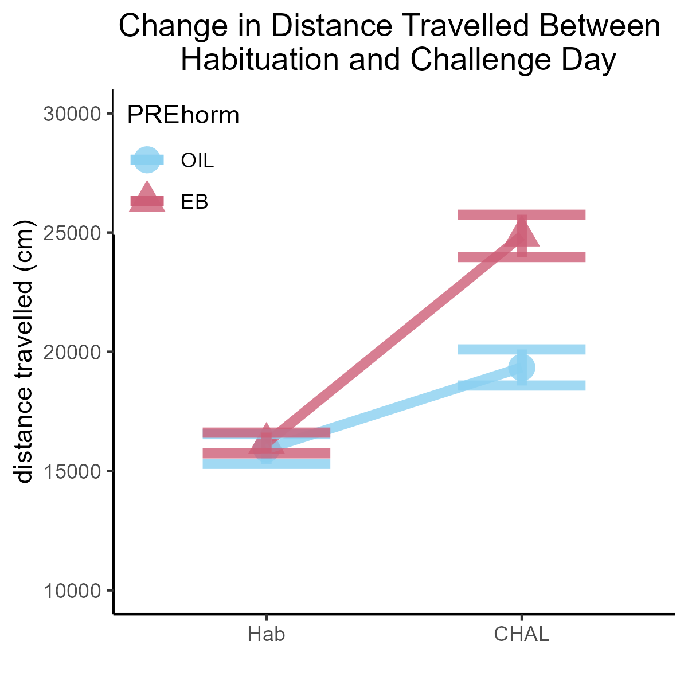

```{r setup, include=FALSE}
require("knitr")
options(htmltools.dir.version = FALSE)
```

# Why use ggplot2? 

There are several ways to create graphical visualizations in R, but ggplot is by far the most comprehensive and well-documented. 

- ggplot2 allows for control of every element of the chart. 
- any graph that you can imagine, you can make!

```{r,message=FALSE,warning=FALSE}
library(tidyverse) # The tidyverse contains ggplot2.
library(reshape2) # for the melt function.
```

```{r,message=FALSE,warning=FALSE}
data <- read_csv("EB_Rats_Nicotine_Sensitization.csv") # get data

data$PREhorm = factor(data$PREhorm, 
                      levels=c(0,1),
                      labels=c("OIL","EB"))

data$CHALhorm = factor(data$CHALhorm,
                      levels=c(0,1),
                      labels=c("OIL","EB"))
```

Take a look at the top 6 rows of data: 
```{r}
head(data)
```

Use ggplot in combination with dplyr-style code blocks:
```{r,message=FALSE,warning=FALSE}
data %>% # take the data, AND THEN
  select(c("ID","PREhorm","Hab")) %>% # select columns of interest
  group_by(PREhorm) %>% # Group by between-sub variable
  summarise(n=n(), # Count the number of individuals per group
            mean=mean(Hab), # Calculate the mean for each group 
            sd=sd(Hab))%>% # Calculate sd for each group
  mutate(se=sd/sqrt(n-1)) %>% # Calculate se for each group
  ggplot(aes(x=PREhorm,y=mean,colour=PREhorm,fill=PREhorm))+ # base layer ggplot
  geom_bar(stat="identity",alpha=0.2)+ # add bars
  geom_errorbar(aes(x=PREhorm,ymin=mean-se,ymax=mean+se), # add error bars (se)
                width=0.5,alpha=0.8)+
  scale_colour_manual(values=c("#89CFF0","#CD5E77"))+ # select colours
  scale_fill_manual(values=c("#89CFF0","#CD5E77"))+
  theme_classic()+ # adjust theme
  theme(legend.position = "none")+ # remove useless legend
  theme(plot.title = element_text(hjust=0.5))+ # center title
  ylim(0,35000)+ # limits of the y-axis
  labs(y="distance travelled (cm)", # chart labels 
       x="",
       title="Distance Travelled on the Habituation Day")+
  geom_jitter(data=data, # Add individual points
              aes(x=PREhorm,y=Hab,shape=PREhorm,colour=PREhorm),
              width=0.15,size=5,alpha=0.5)
```

Adjusting / writing over a few aspects of the code would allow for exploration of various approaches to data visualization. 
```{r,message=FALSE,warning=FALSE}
data %>% # take the data, AND THEN
  select(c("ID","PREhorm","Hab","CHAL")) %>% # select columns of interest
  melt(id.vars=c("ID","PREhorm")) %>% # Switch data to long form
  group_by(PREhorm,variable) %>% # Group by between-sub variable
  summarise(n=n(), # Count the number of individuals per group
            mean=mean(value), # Calculate the mean for each group 
            sd=sd(value))%>% # Calculate sd for each group
  mutate(se=sd/sqrt(n-1)) %>%
  ggplot(aes(x=variable,y=mean,colour=PREhorm,shape=PREhorm,group=PREhorm))+
  geom_point(size=5,alpha=0.8)+
  geom_line(size=2, alpha=0.8)+
  geom_errorbar(aes(x=variable,ymin=mean-se,ymax=mean+se),size=2,width=0.5,alpha=0.8)+
  scale_colour_manual(values=c("#89CFF0","#CD5E77"))+ # select colours
  theme_classic()+ # adjust theme
  theme(legend.position = c(0,1),legend.justification = c(0,1))+ # remove useless legend
  theme(plot.title = element_text(hjust=0.5))+ # center title
  ylim(10000,30000)+
  labs(y="distance travelled (cm)",
       x="",
       title="Change in Distance Travelled Between \n Habituation and Challenge Day")

```

Using dplyr-style code blocks is the quickest way to generate in-line charts while exploring a dataset in R. to save a copy of the ggplot, assign the output of the code chunk to an object, then use ggsave to save the object as a png image: 

```{r,message=FALSE,warning=FALSE}
a <- data %>% # take the data, AND THEN
  select(c("ID","PREhorm","Hab","CHAL")) %>% # select columns of interest
  melt(id.vars=c("ID","PREhorm")) %>% # Switch data to long form
  group_by(PREhorm,variable) %>% # Group by between-sub variable
  summarise(n=n(), # Count the number of individuals per group
            mean=mean(value), # Calculate the mean for each group 
            sd=sd(value))%>% # Calculate sd for each group
  mutate(se=sd/sqrt(n-1)) %>%
  ggplot(aes(x=variable,y=mean,colour=PREhorm,shape=PREhorm,group=PREhorm))+
  geom_point(size=5,alpha=0.8)+
  geom_line(size=2, alpha=0.8)+
  geom_errorbar(aes(x=variable,ymin=mean-se,ymax=mean+se),size=2,width=0.5,alpha=0.8)+
  scale_colour_manual(values=c("#89CFF0","#CD5E77"))+ # select colours
  theme_classic()+ # adjust theme
  theme(legend.position = c(0,1),legend.justification = c(0,1))+ # remove useless legend
  theme(plot.title = element_text(hjust=0.5))+ # center title
  ylim(10000,30000)+
  labs(y="distance travelled (cm)",
       x="",
       title="Change in Distance Travelled Between \n Habituation and Challenge Day")

# Save the image 4in tall by 4in wide, high quality (dpi=300)
ggsave("example_image.png",a,height=4,width=4,dpi=300)
```

The high-quality image will save the the working directory (the folder where your project is). To call back the .png image, use the knitr function (loaded with the tidyverse package):
```{r}

```


