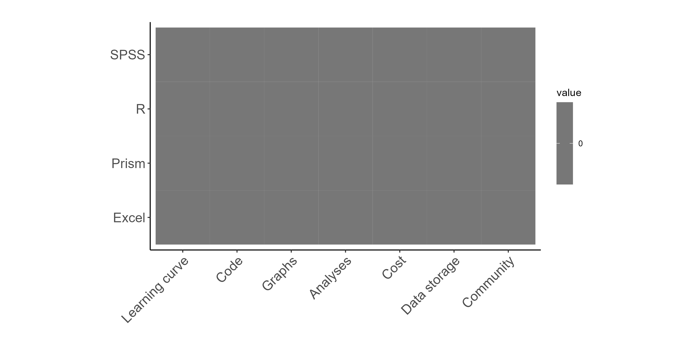
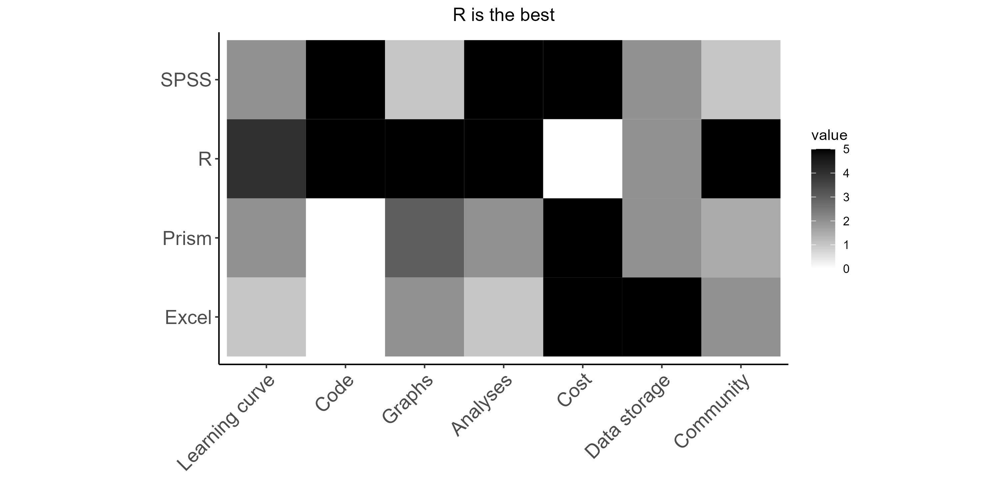

# Why use reproduceable approaches to data analysis? 


<center>

*Word of mouth transmission of information will **always** lead to inaccuracies:*


</center>

### Advantages to code-based (reproduceable) approaches to data analysis and visualization:

**1. Maintain consistency between presentation formats by using continuous file structures.**
  + e.g. lab reports, committee reports, slideshow presentations, conference posters.

**2. Maintain consistency between multiple similar graphs.**
  + e.g. match all the axes across a multi-panel figure.
  
**3. Ease of sharing methods and results.**
  + Academic journals are increasingly moving towards requiring submission of code to replicate analyses and figures along for manuscript consideration. 
  
**4. Improved workflows.**
  + Especially when completing repetitive analysis or visualization tasks, using a code-based approach substantially improves speed and accuracy in workflows.


# Software options for data analysis


A variety of programs are available to you to execute your data analysis / visualization needs.


Each of these programs has strengths and weaknesses in different areas: 

# Software options for data analysis



**Excel** is the best format for longterm storage of hardcoded data 
  + CSV format preferred for raw values
  + Excel wookbook format useful if computing data transformations that involve formulas). 

**R** Provides the best combination of features! Best for basically everything!
  + No point-and-click interface - code only. 

**SPSS** has specific utility while learning methods of data analysis.
  + Unique click-and-point-to-code function. 
  

# Best Practice: Write code

### Advantages of code-based strategies over point-and-click based approaches:

- Allows for reproducible analyses and graphs across time
- And reproduce ability between multiple analyses, figures, etc.
- Drastically speeds up workflows after competency is reached. 
- Provides a scale-able solution for data wrangling and analysis. The size of the data set is not a major consideration when using a code-based approach. 
- Materials can be easily updated or tweaked for various purposes. R provides a simple method to slightly tweak outputs for various presentation formats (e.g. slideshow, written report, publication figure).
#### For example, it would be easy to include the code that I used to generate the above graph if I wanted to share the instructions with a more technical audience: 

Load packages

```r
library(ggplot2) # For generating pretty graphs
library(reshape2) # For data wrangling. 
```

Generate data for tile chart

```r
a <- c(1,2,3,4) # Generate vector 1:4
a <- as.data.frame(a) # Turn the vector into a dataframe
a$Program <- c("Excel","Prism","SPSS","R") # Add a "Program" column
tile <- a # Reassign a  to "tile"
colnames(tile) <- c("ID", "Program") # Name the columns
tile$`Learning curve` <- c(1,2,2,4) # Add data for each attribute
tile$Code <- c(0,0,5,5)
tile$Graphs <- c(2,3,1,5)
tile$Analyses <- c(1,2,5,5)
tile$Cost <- c(1,1,1,0)
tile$`Data storage` <- c(5,2,2,2)
tile$Community <- c(2,1.5,1,5)
m_tile <- melt(tile, id.vars=c("ID", "Program")) # Switch to longform  
```

Generate the tile chart

```r
b <- ggplot(m_tile, aes(x=variable,y=Program,fill=value))+ 
  geom_tile()+
  coord_fixed()+ 
  scale_fill_gradient(low = "white", high = "black")+
  theme_classic()+
  labs(y=" ",x=" ",title="R is the best")+
  theme(axis.text = element_text(size=14))+
  theme(plot.title = element_text(hjust = 0.5))+
  theme(axis.text.x = element_text(angle=45, hjust=1))

b # print out the result!
```

}}index_files/figure-html/unnamed-chunk-7-1.png" width="672" />

The code blocks above could be copied directly into R to generate the exact same chart that I have created. 


